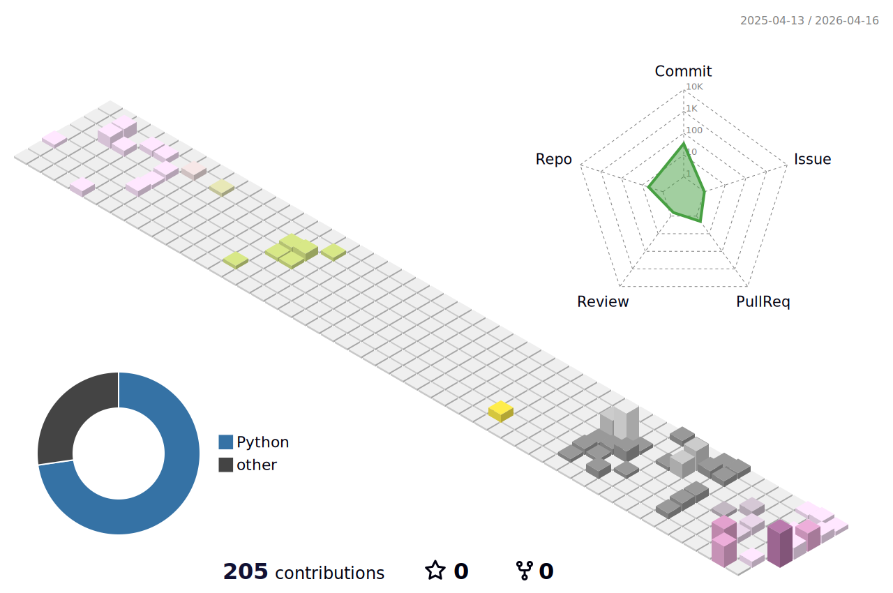
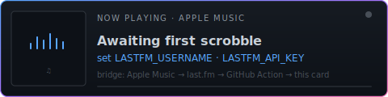
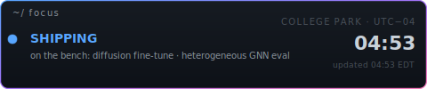

<!-- Animated banner: live neural pipeline. Pure SVG + SMIL, no text that duplicates the bio. -->

  

<h1 align="center">Hi, I'm Vivek Vasisht</h1>

  

  
  
  

---

###  About

> MS Data Science @ UMD. I build **production ML systems** — cloud-native pipelines, fine-tuned diffusion, heterogeneous graph models, and real-time inference services.

-  **Shipping:** cloud-native ML pipelines on AWS + GPU inference services
-  **Working in:** PyTorch, Diffusion, GNNs, MLOps, streaming data
-  **Learning:** distributed training, LLM fine-tuning, model serving at scale
-  **Reach me:** evivek@umd.edu

---

###  Stack

<!-- Each icon links to a filtered search of my repos using that technology. -->

  
  
  
  
  
  
  
  
  
  
  
  
  
  

↑ each icon links to the repos in my profile that use that tech.

---

###  Featured Projects

<table>
  <tr>
    <td width="50%" valign="top">
      
    </td>
    <td width="50%" valign="top">
      
    </td>
  </tr>
  <tr>
    <td width="50%" valign="top">
      
    </td>
    <td width="50%" valign="top">
      
    </td>
  </tr>
</table>

---

###  Currently Building

<!-- Auto-refreshed every 6h by .github/workflows/currently-building.yml -->
<!-- CURRENTLY-BUILDING:START -->
<table><tr><td width='33%' valign='top'><a href='https://github.com/ViVas970811/Meshwatch'><b>Meshwatch</b></a> Graph-native fraud detection in real time. Heterogeneous GNN (PyTorch Geometric) + XGBoost  ● Python &nbsp; ★ 1 &nbsp; · &nbsp; pushed just now</td><td width='33%' valign='top'><a href='https://github.com/ViVas970811/ClearShot'><b>ClearShot</b></a> A diffusion-based pipeline for enhancing amateur product photos to professional quality. U  ● Python &nbsp; ★ 1 &nbsp; · &nbsp; pushed 2d ago</td></tr></table>
<!-- CURRENTLY-BUILDING:END -->

---

###  GitHub Metrics

  
  

  

---

###  Contribution Activity

  

---

###  Achievements

  

---

###  3D Contribution Calendar

  

---

###  Contribution Snake

  <picture>
    <source media="(prefers-color-scheme: dark)"  srcset="https://raw.githubusercontent.com/ViVas970811/ViVas970811/output/github-contribution-grid-snake-dark.svg">
    <source media="(prefers-color-scheme: light)" srcset="https://raw.githubusercontent.com/ViVas970811/ViVas970811/output/github-contribution-grid-snake.svg">
    
  </picture>

---

###  Off the Clock

<table>
  <tr>
    <td width="50%" valign="top" align="center">
      
    </td>
    <td width="50%" valign="top" align="center">
      
    </td>
  </tr>
</table>

↑ <b>On repeat</b> — click the card to listen on Spotify.

---

  <i>Thanks for stopping by — drop me a line at <a href="mailto:evivek@umd.edu">evivek@umd.edu</a>.</i>

<a href="easter.md" title="·">·</a>

