<!-- Animated banner: live neural pipeline. Pure SVG + SMIL, no text that duplicates the bio. -->

  

<h1 align="center">Hi, I'm Vivek Vasisht</h1>

  

  
  
  

---

###  About

> MS Data Science @ UMD. I build **production ML systems** — cloud-native pipelines, fine-tuned diffusion, heterogeneous graph models, and real-time inference services.

-  **Shipping:** cloud-native ML pipelines on AWS + GPU inference services
-  **Working in:** PyTorch, Diffusion, GNNs, MLOps, streaming data
-  **Learning:** distributed training, LLM fine-tuning, model serving at scale
-  **Reach me:** evivek@umd.edu

---

###  Stack

  

---

###  Featured Projects

<table>
  <tr>
    <td width="50%" valign="top">
      
    </td>
    <td width="50%" valign="top">
      
    </td>
  </tr>
  <tr>
    <td width="50%" valign="top">
      
    </td>
    <td width="50%" valign="top">
      
    </td>
  </tr>
</table>

---

###  GitHub Metrics

  
  

  

---

###  Coding Habits & Repos

<!-- These four SVGs come from the lowlighter/metrics Action. -->

  

  
  

  
  

---

###  3D Contribution Calendar

  

---

###  Contribution Snake

  <picture>
    <source media="(prefers-color-scheme: dark)"  srcset="https://raw.githubusercontent.com/ViVas970811/ViVas970811/output/github-contribution-grid-snake-dark.svg">
    <source media="(prefers-color-scheme: light)" srcset="https://raw.githubusercontent.com/ViVas970811/ViVas970811/output/github-contribution-grid-snake.svg">
    
  </picture>

---

###  Latest Writing

<!-- BLOG-POST-LIST:START -->
<!-- BLOG-POST-LIST:END -->

↑ auto-updated every 4 hours from my blog via GitHub Actions.

---

  <i>Thanks for stopping by — drop me a line at <a href="mailto:evivek@umd.edu">evivek@umd.edu</a>.</i>

