<!-- ═══════════════════════════════════════════════════════════════════════
     SYNTHWAVE PROFILE · v2 · theme-aware (dark default, light fallback)
     ═══════════════════════════════════════════════════════════════════════ -->

  <picture>
    <source media="(prefers-color-scheme: dark)"  srcset="banners/banner-synthwave.svg">
    <source media="(prefers-color-scheme: light)" srcset="banners/banner-synthwave-light.svg">
    
  </picture>

  <picture>
    <source media="(prefers-color-scheme: dark)"  srcset="banners/status-availability.svg">
    <source media="(prefers-color-scheme: light)" srcset="banners/status-availability-light.svg">
    
  </picture>

  
  
  

  <picture>
    <source media="(prefers-color-scheme: dark)"  srcset="banners/divider-neon.svg">
    <source media="(prefers-color-scheme: light)" srcset="banners/divider-neon-light.svg">
    
  </picture>

## `~/ about`

> **MS Data Science @ UMD.** I build **production ML systems** — cloud-native pipelines, fine-tuned diffusion, heterogeneous graph models, and real-time inference services.

- **Shipping** — cloud-native ML pipelines on AWS + GPU inference services
- **Working in** — PyTorch · Diffusion · GNNs · MLOps · streaming data
- **Learning** — distributed training · LLM fine-tuning · model serving at scale
- **Reach me** — [evivek@umd.edu](mailto:evivek@umd.edu)

  <picture>
    <source media="(prefers-color-scheme: dark)"  srcset="banners/divider-neon.svg">
    <source media="(prefers-color-scheme: light)" srcset="banners/divider-neon-light.svg">
    
  </picture>

## `~/ stack`

  <picture>
    <source media="(prefers-color-scheme: dark)"  srcset="https://skillicons.dev/icons?i=python,pytorch,tensorflow,sklearn,opencv,aws,docker,kafka,postgres,fastapi,linux,git,github,vscode&theme=dark">
    <source media="(prefers-color-scheme: light)" srcset="https://skillicons.dev/icons?i=python,pytorch,tensorflow,sklearn,opencv,aws,docker,kafka,postgres,fastapi,linux,git,github,vscode&theme=light">
    
  </picture>

  <picture>
    <source media="(prefers-color-scheme: dark)"  srcset="banners/divider-neon.svg">
    <source media="(prefers-color-scheme: light)" srcset="banners/divider-neon-light.svg">
    
  </picture>

## `~/ featured-projects`

<table>
  <tr>
    <td width="50%" valign="top">
      <a href="https://github.com/ViVas970811/WildlifeDetection_YOLOv8">
        <picture>
          <source media="(prefers-color-scheme: dark)"  srcset="https://github-readme-stats.vercel.app/api/pin/?username=ViVas970811&repo=WildlifeDetection_YOLOv8&theme=radical&hide_border=true&bg_color=1a0033&title_color=ff2e9f&icon_color=05d9e8&text_color=fffb96">
          <source media="(prefers-color-scheme: light)" srcset="https://github-readme-stats.vercel.app/api/pin/?username=ViVas970811&repo=WildlifeDetection_YOLOv8&hide_border=true&bg_color=fff5fa&title_color=d6246e&icon_color=0091a8&text_color=1a0033">
          
        </picture>
      </a>
    </td>
    <td width="50%" valign="top">
      <a href="https://github.com/ViVas970811/MedQA">
        <picture>
          <source media="(prefers-color-scheme: dark)"  srcset="https://github-readme-stats.vercel.app/api/pin/?username=ViVas970811&repo=MedQA&theme=radical&hide_border=true&bg_color=1a0033&title_color=ff2e9f&icon_color=05d9e8&text_color=fffb96">
          <source media="(prefers-color-scheme: light)" srcset="https://github-readme-stats.vercel.app/api/pin/?username=ViVas970811&repo=MedQA&hide_border=true&bg_color=fff5fa&title_color=d6246e&icon_color=0091a8&text_color=1a0033">
          
        </picture>
      </a>
    </td>
  </tr>
  <tr>
    <td width="50%" valign="top">
      <a href="https://github.com/ViVas970811/ClearShot">
        <picture>
          <source media="(prefers-color-scheme: dark)"  srcset="https://github-readme-stats.vercel.app/api/pin/?username=ViVas970811&repo=ClearShot&theme=radical&hide_border=true&bg_color=1a0033&title_color=ff2e9f&icon_color=05d9e8&text_color=fffb96">
          <source media="(prefers-color-scheme: light)" srcset="https://github-readme-stats.vercel.app/api/pin/?username=ViVas970811&repo=ClearShot&hide_border=true&bg_color=fff5fa&title_color=d6246e&icon_color=0091a8&text_color=1a0033">
          
        </picture>
      </a>
    </td>
    <td width="50%" valign="top">
      <a href="https://github.com/ViVas970811/Meshwatch">
        <picture>
          <source media="(prefers-color-scheme: dark)"  srcset="https://github-readme-stats.vercel.app/api/pin/?username=ViVas970811&repo=Meshwatch&theme=radical&hide_border=true&bg_color=1a0033&title_color=ff2e9f&icon_color=05d9e8&text_color=fffb96">
          <source media="(prefers-color-scheme: light)" srcset="https://github-readme-stats.vercel.app/api/pin/?username=ViVas970811&repo=Meshwatch&hide_border=true&bg_color=fff5fa&title_color=d6246e&icon_color=0091a8&text_color=1a0033">
          
        </picture>
      </a>
    </td>
  </tr>
</table>

  <picture>
    <source media="(prefers-color-scheme: dark)"  srcset="banners/divider-neon.svg">
    <source media="(prefers-color-scheme: light)" srcset="banners/divider-neon-light.svg">
    
  </picture>

## `~/ github-metrics`

  <picture>
    <source media="(prefers-color-scheme: dark)"  srcset="https://github-readme-stats.vercel.app/api?username=ViVas970811&show_icons=true&hide_border=true&include_all_commits=true&count_private=true&bg_color=1a0033&title_color=ff2e9f&icon_color=05d9e8&text_color=fffb96&ring_color=b967ff">
    <source media="(prefers-color-scheme: light)" srcset="https://github-readme-stats.vercel.app/api?username=ViVas970811&show_icons=true&hide_border=true&include_all_commits=true&count_private=true&bg_color=fff5fa&title_color=d6246e&icon_color=0091a8&text_color=1a0033&ring_color=8e2de2">
    
  </picture>
  <picture>
    <source media="(prefers-color-scheme: dark)"  srcset="https://github-readme-stats.vercel.app/api/top-langs/?username=ViVas970811&layout=compact&hide_border=true&langs_count=8&bg_color=1a0033&title_color=ff2e9f&text_color=fffb96">
    <source media="(prefers-color-scheme: light)" srcset="https://github-readme-stats.vercel.app/api/top-langs/?username=ViVas970811&layout=compact&hide_border=true&langs_count=8&bg_color=fff5fa&title_color=d6246e&text_color=1a0033">
    
  </picture>

  <picture>
    <source media="(prefers-color-scheme: dark)"  srcset="https://github-readme-streak-stats.herokuapp.com/?user=ViVas970811&hide_border=true&background=1a0033&stroke=b967ff&ring=ff2e9f&fire=05d9e8&currStreakLabel=fffb96&currStreakNum=fffb96&sideLabels=ff71ce&dates=b967ff&sideNums=fffb96">
    <source media="(prefers-color-scheme: light)" srcset="https://github-readme-streak-stats.herokuapp.com/?user=ViVas970811&hide_border=true&background=fff5fa&stroke=8e2de2&ring=d6246e&fire=0091a8&currStreakLabel=1a0033&currStreakNum=1a0033&sideLabels=d6246e&dates=8e2de2&sideNums=1a0033">
    
  </picture>

  <picture>
    <source media="(prefers-color-scheme: dark)"  srcset="banners/divider-neon.svg">
    <source media="(prefers-color-scheme: light)" srcset="banners/divider-neon-light.svg">
    
  </picture>

## `~/ contribution-calendar`

  

  <picture>
    <source media="(prefers-color-scheme: dark)"  srcset="https://raw.githubusercontent.com/ViVas970811/ViVas970811/output/github-contribution-grid-snake-dark.svg">
    <source media="(prefers-color-scheme: light)" srcset="https://raw.githubusercontent.com/ViVas970811/ViVas970811/output/github-contribution-grid-snake.svg">
    
  </picture>

  <picture>
    <source media="(prefers-color-scheme: dark)"  srcset="banners/divider-neon.svg">
    <source media="(prefers-color-scheme: light)" srcset="banners/divider-neon-light.svg">
    
  </picture>

  <i>Thanks for stopping by — drop a line at <a href="mailto:evivek@umd.edu">evivek@umd.edu</a>.</i>

